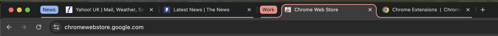
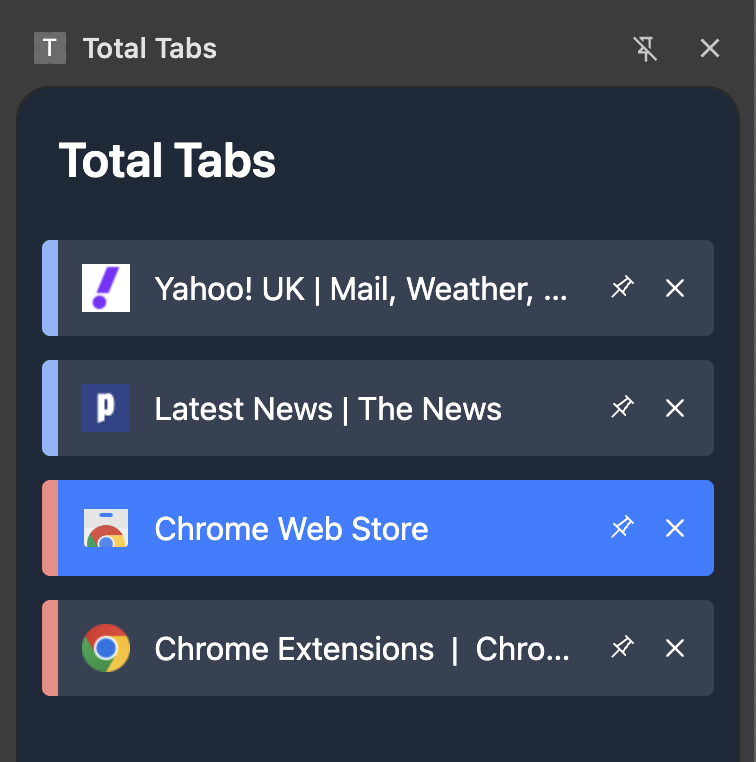

# Technical Assessment: Senior Browser Extension Engineer

## Overview

This assessment will test your ability to:

- Navigate and understand an unfamiliar codebase.
- Interpret feature requests, plan their implementation, and execute them effectively.
- Demonstrate proficiency in TypeScript, React, Tailwind, and Chrome Extension APIs.

You’ll work with an existing Chrome extension codebase (this project) and over the course of ~2 hours you'll implement a couple of small feature requests.

The exercise aims to simulate a real-world task, reflecting the type of work you’d encounter in this role. It’s split into two phases and you’ll have full access to all the regular tools you would do on the job (Google, Stack Overflow, ChatGPT etc.).

Based on your submission, we may invite you to a follow-up interview where you'll walk us through your implementation and discuss your approach in more detail.

## Project: Tab Manager Chrome Extension

This project is a simple Chrome extension that helps users manage their browser tabs. It currently has the following basic features:

- Displays all tabs in the current window within a side panel, which can be opened and closed by clicking the extension icon.
- Ability to close, pin, unpin and reorder tabs.
- Syncs with the browser in real-time: closing, pinning, or reordering tabs in the side panel is reflected in the browser, and vice versa.

## Assessment Structure

### What You’ll Do

You’ll work through a couple of new features which will require you to understand the existing code and browser extension APIs being used, then plan and implement a solution.

### What We’re Assessing

- **Technical Skills:** Proficiency with our tech stack and the ability to work with potentially unfamiliar libraries and APIs.
- **Problem-Solving:** Debugging, anticipating edge cases, and weighing trade-offs.
- **Code Quality:** Writing clean, maintainable code with informed design choices.

## Getting Started

Before beginning the assessment, get the extension running locally:

##### 1. Install Dependencies:

```bash  
yarn install
```  

##### 2. Build and Watch in Development Mode:

```bash  
ENV=dev npm run build -- --watch  
```  

##### 3. Load the Extension in Chrome:

- Open `chrome://extensions`.
- Enable "Developer mode."
- Click "Load unpacked" and select the `build` directory.
- The side panel will now appear when you click the extension icon.


Take some time to familiarise yourself with the project structure and existing code. Understanding the patterns used will help you match the existing code style and implement the required changes without over-engineering.
  
---  

## Part 1: Select Component & Window Switching (~1 hour)

Currently the sidebar displays tabs from the current window only. Add the ability to view tabs from any open window via a dropdown selector.

### Requirements

**Part 1A: Generic Select Component**
- Create a reusable `Select` component using [Radix UI](https://www.radix-ui.com/primitives)'s `Select` primitives
- It should be a controlled component with a simple, minimal API that doesn't expose Radix-specific details outside the component
- Focus on implementing what you need to meet the requirements of the task rather than building for every possible use case
- Style with Tailwind to match the existing UI (use your judgment)
- Follow existing component conventions in the codebase

**Part 1B: Window Selection**

Add a window selector that lets users view tabs from any of their open Chrome windows.

- Add your `Select` component to the top of the sidebar, above the list of tabs
- Populate the dropdown with all open Chrome windows, labeled as "Window 1", "Window 2", etc. (sorted by window ID, ascending)
- Mark the window that the sidebar is displayed in as "Window X (current)"
- The default dropdown selection should be the current window (the window the sidebar is displayed in)
- When the user chooses a different window from the dropdown, update the tab list accordingly

**Note:** The existing state management already tracks windows and tabs, so you'll primarily need to build the `Select` component and wire it up to the existing data.

---  

## Part 2: Tab Groups Integration (~1 hour)

Chrome allows users to organise tabs into groups, each with a colour and optional label. See below for an example:



Add support for displaying tab group colours in the sidebar. When a tab belongs to a group, the left border of its `TabCard` should match the group's colour.

When you're finished it should look something like this:



### Requirements

- When a tab belongs to a Chrome tab group, the left border of its `TabCard` should display the group's colour
- Ungrouped tabs should not display a coloured border
- Group colours should sync in real-time with the browser:
  - When tabs are added to or removed from groups
  - When tabs move between groups
  - When group colours change
  - When groups are created or deleted

---  

## Submission

**Deliverables:**
- Working code that satisfies the requirements outlined above
- Clear, descriptive git commits showing your progression
- Brief notes in SUBMISSION.md (in the project root) covering:
  - Overview of your implementation approach
  - Key technical decisions and trade-offs you considered
  - Any assumptions you made
  - Known limitations or incomplete features (if applicable)
  - Approximate time spent

**How to Submit:**
1. Create a branch from `master` for your work
2. Make your changes with clear git commits
3. Create a Pull Request to merge your branch back into `master`
4. Once your PR is ready for review, email `mike.burke@totalsecurity.com`, `tom.knox@totalsecurity.com` and `shane.crossan@totalsecurity.com` with a link to the PR.

**Next steps:** We'll review your PR and may invite you to a follow-up interview to discuss your implementation.
  
---  

## Tips

- **Use all available resources:** Docs, Google, Stack Overflow, ChatGPT - this is designed to test real-world work, not memorisation.
- **Dependencies:** Minimise adding new dependencies where possible, but you can add them if needed for your implementation.
- **Time management:** You should be able to complete this within 2-3 hours but feel free to spend more time if you feel it's necessary.
- **Ship incomplete if needed:** Focus on quality over completeness. Document what's missing in your notes. We understand time constraints.

---  

## Questions?

If you have any questions about the assessment or run into technical issues, please reach out to `mike.burke@totalsecurity.com`.

Good luck! We're looking forward to seeing your work.
